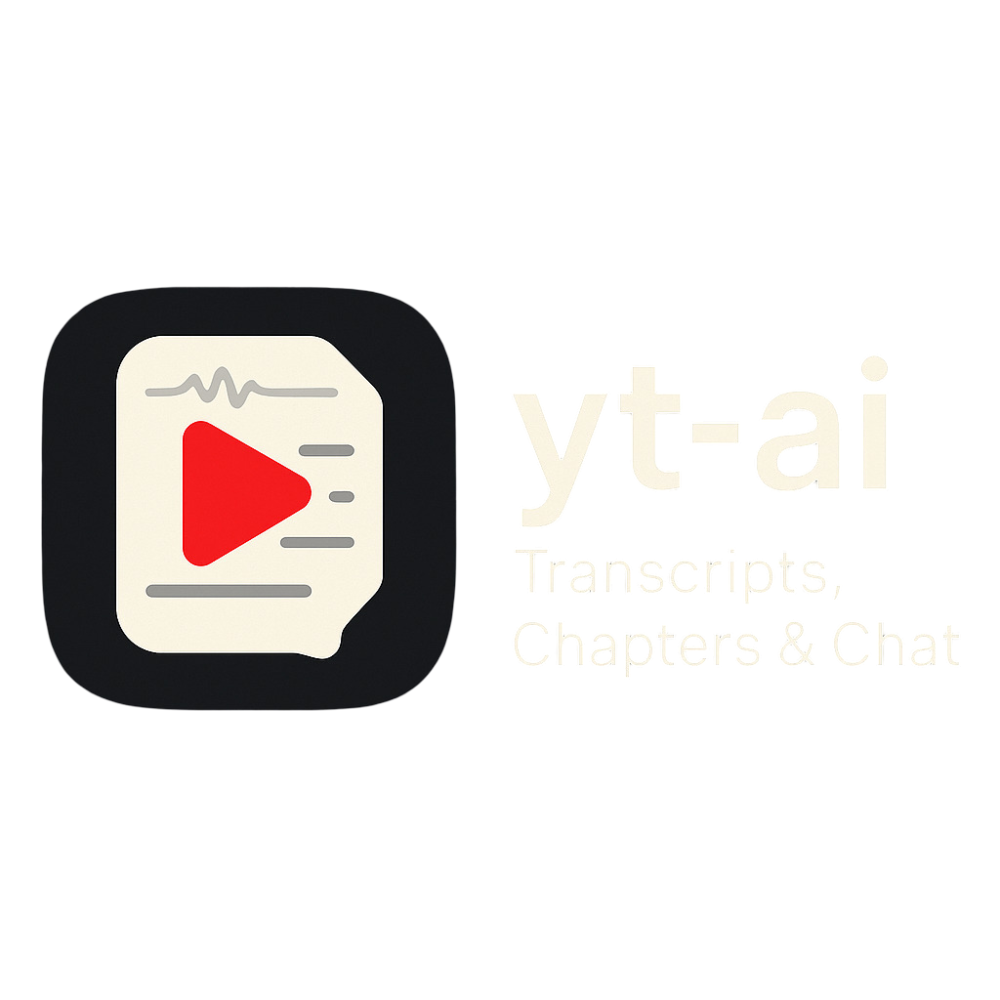

<div id="top">

<!-- HEADER STYLE: MODERN -->
<div align="center" style="width: 100%;">



# YT-TRANSCRIPT-AI

<em>Unlock AI insights from YouTube transcripts effortlessly.<em>

<!-- BADGES -->


<em>Built with the tools and technologies:</em>


<br>


</div>
</div>
<br clear="right">

---

## ⟡ Table of Contents

<details>
<summary>Table of Contents</summary>

- [⟡ Table of Contents](#-table-of-contents)
- [◈ Overview](#-overview)
- [⟢ Features](#-features)
- [◇ Project Structure](#-project-structure)
    - [◊ Project Index](#-project-index)
- [⟠ Getting Started](#-getting-started)
    - [⟁ Prerequisites](#-prerequisites)
    - [⟒ Installation](#-installation)
    - [⟓ Usage](#-usage)
    - [⌆ Testing](#-testing)
- [⟲ Roadmap](#-roadmap)
- [⏣ Contributing](#-contributing)
- [⟶ License](#-license)
- [❈ Acknowledgments](#-acknowledgments)

</details>

---

## ◈ Overview

YT-Transcript-AI simplifies video transcript analysis and processing, integrating AI capabilities seamlessly.

**Why YT-Transcript-AI?**

This project revolutionizes video processing with AI integration and offers:

- **🚀 Comprehensive Testing Coverage:** Ensures robust backend, frontend, and API functionality.
- **💡 AI Capabilities:** Enhances video analysis with advanced AI tools.
- **🎨 User-Friendly UI:** Structured design with a dark theme for an engaging experience.
- **🔒 Secure Backend Architecture:** Utilizes FastAPI and essential libraries for performance and security.

---

## ⟢ Features

|      | Component       | Details                              |
| :--- | :-------------- | :----------------------------------- |
| ⚙️  | **Architecture**  | <ul><li>Frontend built with **React** and **Next.js** for server-side rendering.</li><li>Backend powered by **FastAPI** for RESTful APIs.</li></ul> |
| 🔩 | **Code Quality**  | <ul><li>Linting with **ESLint** and **Pylint**.</li><li>Testing with **Jest** and **Pytest**.</li></ul> |
| 📄 | **Documentation** | <ul><li>Includes a **Dockerfile** for backend containerization.</li><li>README files in both frontend and backend directories.</li></ul> |
| 🔌 | **Integrations**  | <ul><li>Integration with **OpenAI** for AI capabilities.</li><li>Utilizes **YouTube Transcript API** for fetching video transcripts.</li></ul> |
| 🧩 | **Modularity**    | <ul><li>Separate frontend and backend directories for clear separation of concerns.</li><li>Modular components in React for reusability.</li></ul> |
| 🧪 | **Testing**       | <ul><li>Unit and integration tests for both frontend and backend.</li><li>Async testing with **Pytest-asyncio**.</li></ul> |
| ⚡️  | **Performance**   | <ul><li>Optimized frontend with **Tailwind CSS** for efficient styling.</li><li>Backend uses **HTTPX** for async HTTP requests.</li></ul> |
| 🛡️ | **Security**      | <ul><li>Secure API handling with **Pydantic** for data validation.</li><li>Environment variable management using **Python-dotenv**.</li></ul> |
| 📦 | **Dependencies**  | <ul><li>Extensive dependencies including **React**, **FastAPI**, **OpenAI**, and **YouTube Transcript API**.</li><li>Package management with **npm** and **pip**.</li></ul> |

---

## ◇ Project Structure

```sh
└── YT-Transcript-AI/
    ├── LICENSE
    ├── README.md
    ├── backend
    │   ├── .dockerignore
    │   ├── Dockerfile
    │   ├── README.md
    │   ├── app
    │   ├── fly.toml
    │   ├── requirements.txt
    │   └── tests
    ├── frontend
    │   ├── .gitignore
    │   ├── README.md
    │   ├── __tests__
    │   ├── eslint.config.mjs
    │   ├── jest.config.js
    │   ├── jest.setup.js
    │   ├── middleware.ts
    │   ├── next.config.ts
    │   ├── package-lock.json
    │   ├── package.json
    │   ├── postcss.config.mjs
    │   ├── public
    │   ├── src
    │   └── tsconfig.json
    └── run-tests.sh
```

### ◊ Project Index

<details open>
	<summary><b><code>YT-TRANSCRIPT-AI/</code></b></summary>
	<!-- __root__ Submodule -->
	<details>
		<summary><b>__root__</b></summary>
		<blockquote>
			<div class='directory-path' style='padding: 8px 0; color: #666;'>
				<code><b>⦿ __root__</b></code>
			<table style='width: 100%; border-collapse: collapse;'>
			<thead>
				<tr style='background-color: #f8f9fa;'>
					<th style='width: 30%; text-align: left; padding: 8px;'>File Name</th>
					<th style='text-align: left; padding: 8px;'>Summary</th>
				</tr>
			</thead>
				<tr style='border-bottom: 1px solid #eee;'>
					<td style='padding: 8px;'><b><a href='https://github.com/tarekchaalan/YT-Transcript-AI/blob/master/LICENSE'>LICENSE</a></b></td>
					<td style='padding: 8px;'>- Define the projects licensing terms<br>- Grant permission to use, modify, distribute, and sell the software<br>- Include copyright notice in all copies<br>- No warranties provided<br>- Authors not liable for damages.</td>
				</tr>
				<tr style='border-bottom: 1px solid #eee;'>
					<td style='padding: 8px;'><b><a href='https://github.com/tarekchaalan/YT-Transcript-AI/blob/master/run-tests.sh'>run-tests.sh</a></b></td>
					<td style='padding: 8px;'>- Run tests for the yt-ai project, covering backend, frontend, and API components<br>- Executes unit tests, specific test categories, and component tests<br>- Provides a comprehensive test coverage summary for backend, frontend, and API functionalities<br>- Prepares the project for deployment.</td>
				</tr>
			</table>
		</blockquote>
	</details>
	<!-- frontend Submodule -->
	<details>
		<summary><b>frontend</b></summary>
		<blockquote>
			<div class='directory-path' style='padding: 8px 0; color: #666;'>
				<code><b>⦿ frontend</b></code>
			<table style='width: 100%; border-collapse: collapse;'>
			<thead>
				<tr style='background-color: #f8f9fa;'>
					<th style='width: 30%; text-align: left; padding: 8px;'>File Name</th>
					<th style='text-align: left; padding: 8px;'>Summary</th>
				</tr>
			</thead>
				<tr style='border-bottom: 1px solid #eee;'>
					<td style='padding: 8px;'><b><a href='https://github.com/tarekchaalan/YT-Transcript-AI/blob/master/frontend/middleware.ts'>middleware.ts</a></b></td>
					<td style='padding: 8px;'>- The <code>middleware.ts</code> file in the <code>frontend</code> directory processes incoming requests to extract YouTube video IDs and time parameters<br>- It ensures proper routing for YouTube video playback by parsing URLs and handling different path variations<br>- The middleware filters out specific routes and formats URLs for internal routing, enhancing the applications video playback functionality.</td>
				</tr>
				<tr style='border-bottom: 1px solid #eee;'>
					<td style='padding: 8px;'><b><a href='https://github.com/tarekchaalan/YT-Transcript-AI/blob/master/frontend/jest.setup.js'>jest.setup.js</a></b></td>
					<td style='padding: 8px;'>- Enhance Jest testing capabilities by importing @testing-library/jest-dom in the frontend/jest.setup.js file<br>- This addition improves the testing environment, ensuring more robust and accurate testing outcomes within the project's architecture.</td>
				</tr>
				<tr style='border-bottom: 1px solid #eee;'>
					<td style='padding: 8px;'><b><a href='https://github.com/tarekchaalan/YT-Transcript-AI/blob/master/frontend/postcss.config.mjs'>postcss.config.mjs</a></b></td>
					<td style='padding: 8px;'>Configure PostCSS with TailwindCSS plugin for frontend styling.</td>
				</tr>
				<tr style='border-bottom: 1px solid #eee;'>
					<td style='padding: 8px;'><b><a href='https://github.com/tarekchaalan/YT-Transcript-AI/blob/master/frontend/jest.config.js'>jest.config.js</a></b></td>
					<td style='padding: 8px;'>- Configure Jest for Next.js testing environment by extending the default setup<br>- Customize Jest settings for test environment, module mapping, and coverage collection<br>- Ensure proper test file exclusion and setup file inclusion<br>- Export the Jest configuration to enable loading of Next.js config asynchronously.</td>
				</tr>
				<tr style='border-bottom: 1px solid #eee;'>
					<td style='padding: 8px;'><b><a href='https://github.com/tarekchaalan/YT-Transcript-AI/blob/master/frontend/package-lock.json'>package-lock.json</a></b></td>
					<td style='padding: 8px;'>- SummaryThe <code>frontend/package-lock.json</code> file in the project contains the lockfile for the frontend application<br>- It specifies the exact versions of dependencies required for the frontend module to ensure consistent builds across different environments<br>- The file lists dependencies such as <code>next</code>, <code>react</code>, <code>react-dom</code>, and <code>react-markdown</code>, along with devDependencies like <code>@eslint/eslintrc</code>, <code>@tailwindcss/postcss</code>, and <code>@testing-library/...</code><br>- By locking the versions of these dependencies, the file helps in maintaining a stable and reproducible frontend application build process.</td>
				</tr>
				<tr style='border-bottom: 1px solid #eee;'>
					<td style='padding: 8px;'><b><a href='https://github.com/tarekchaalan/YT-Transcript-AI/blob/master/frontend/package.json'>package.json</a></b></td>
					<td style='padding: 8px;'>- Define the frontend projects build and development processes<br>- Manage dependencies, scripts, and testing with Next.js, React, and Jest<br>- Ensure code quality with ESLint and TypeScript<br>- Optimize styling using Tailwind CSS<br>- Achieve seamless integration and testing for a robust frontend architecture.</td>
				</tr>
				<tr style='border-bottom: 1px solid #eee;'>
					<td style='padding: 8px;'><b><a href='https://github.com/tarekchaalan/YT-Transcript-AI/blob/master/frontend/tsconfig.json'>tsconfig.json</a></b></td>
					<td style='padding: 8px;'>- Define TypeScript compiler options for the frontend, ensuring strict type checking and ES2017 target<br>- Configure module resolution for bundler, with paths mapping to source directory<br>- Exclude unnecessary files like node_modules and coverage for efficient compilation.</td>
				</tr>
				<tr style='border-bottom: 1px solid #eee;'>
					<td style='padding: 8px;'><b><a href='https://github.com/tarekchaalan/YT-Transcript-AI/blob/master/frontend/eslint.config.mjs'>eslint.config.mjs</a></b></td>
					<td style='padding: 8px;'>- Define ESLint configuration for Next.js project, leveraging FlatCompat for compatibility<br>- Excludes specified directories and files from linting.</td>
				</tr>
				<tr style='border-bottom: 1px solid #eee;'>
					<td style='padding: 8px;'><b><a href='https://github.com/tarekchaalan/YT-Transcript-AI/blob/master/frontend/next.config.ts'>next.config.ts</a></b></td>
					<td style='padding: 8px;'>Define the Next.js configuration for the frontend, encapsulating key settings.</td>
				</tr>
			</table>
			<!-- __tests__ Submodule -->
			<details>
				<summary><b>__tests__</b></summary>
				<blockquote>
					<div class='directory-path' style='padding: 8px 0; color: #666;'>
						<code><b>⦿ frontend.__tests__</b></code>
					<table style='width: 100%; border-collapse: collapse;'>
					<thead>
						<tr style='background-color: #f8f9fa;'>
							<th style='width: 30%; text-align: left; padding: 8px;'>File Name</th>
							<th style='text-align: left; padding: 8px;'>Summary</th>
						</tr>
					</thead>
						<tr style='border-bottom: 1px solid #eee;'>
							<td style='padding: 8px;'><b><a href='https://github.com/tarekchaalan/YT-Transcript-AI/blob/master/frontend/__tests__/page.test.tsx'>page.test.tsx</a></b></td>
							<td style='padding: 8px;'>- Test the Home Page component to ensure proper rendering of main heading, description, and layout classes<br>- Use @testing-library/react to validate the presence and content of elements<br>- This file plays a crucial role in maintaining the quality and functionality of the Home Page component within the projects frontend architecture.</td>
						</tr>
						<tr style='border-bottom: 1px solid #eee;'>
							<td style='padding: 8px;'><b><a href='https://github.com/tarekchaalan/YT-Transcript-AI/blob/master/frontend/__tests__/shortcuts.test.tsx'>shortcuts.test.tsx</a></b></td>
							<td style='padding: 8px;'>- Test the useChapterShortcuts hook by simulating key presses j and k to jump between chapters<br>- Mocks the hook behavior to ensure proper functionality and integration with the onJump callback<br>- This file validates the rendering and implementation of the mocked hook, confirming its expected behavior within the project's architecture.</td>
						</tr>
						<tr style='border-bottom: 1px solid #eee;'>
							<td style='padding: 8px;'><b><a href='https://github.com/tarekchaalan/YT-Transcript-AI/blob/master/frontend/__tests__/video-page.test.tsx'>video-page.test.tsx</a></b></td>
							<td style='padding: 8px;'>- Test the Video Page component for loading, error handling, rendering video content, YouTube iframe, timestamps, transcript segments, chapter navigation, and export links<br>- Mock Next.js hooks and fetch requests for comprehensive testing coverage.</td>
						</tr>
					</table>
				</blockquote>
			</details>
			<!-- src Submodule -->
			<details>
				<summary><b>src</b></summary>
				<blockquote>
					<div class='directory-path' style='padding: 8px 0; color: #666;'>
						<code><b>⦿ frontend.src</b></code>
					<!-- types Submodule -->
					<details>
						<summary><b>types</b></summary>
						<blockquote>
							<div class='directory-path' style='padding: 8px 0; color: #666;'>
								<code><b>⦿ frontend.src.types</b></code>
							<table style='width: 100%; border-collapse: collapse;'>
							<thead>
								<tr style='background-color: #f8f9fa;'>
									<th style='width: 30%; text-align: left; padding: 8px;'>File Name</th>
									<th style='text-align: left; padding: 8px;'>Summary</th>
								</tr>
							</thead>
								<tr style='border-bottom: 1px solid #eee;'>
									<td style='padding: 8px;'><b><a href='https://github.com/tarekchaalan/YT-Transcript-AI/blob/master/frontend/src/types/react-markdown.d.ts'>react-markdown.d.ts</a></b></td>
									<td style='padding: 8px;'>Define a module for rendering Markdown content in React components.</td>
								</tr>
							</table>
						</blockquote>
					</details>
					<!-- app Submodule -->
					<details>
						<summary><b>app</b></summary>
						<blockquote>
							<div class='directory-path' style='padding: 8px 0; color: #666;'>
								<code><b>⦿ frontend.src.app</b></code>
							<table style='width: 100%; border-collapse: collapse;'>
							<thead>
								<tr style='background-color: #f8f9fa;'>
									<th style='width: 30%; text-align: left; padding: 8px;'>File Name</th>
									<th style='text-align: left; padding: 8px;'>Summary</th>
								</tr>
							</thead>
								<tr style='border-bottom: 1px solid #eee;'>
									<td style='padding: 8px;'><b><a href='https://github.com/tarekchaalan/YT-Transcript-AI/blob/master/frontend/src/app/layout.tsx'>layout.tsx</a></b></td>
									<td style='padding: 8px;'>- Define the layout for the Youtube AI project, setting the title and description<br>- Implement a structured UI with fonts, styling, and a search bar for YouTube URLs<br>- The layout maintains a dark theme and offers a seamless user experience for accessing AI-powered features.</td>
								</tr>
								<tr style='border-bottom: 1px solid #eee;'>
									<td style='padding: 8px;'><b><a href='https://github.com/tarekchaalan/YT-Transcript-AI/blob/master/frontend/src/app/page.tsx'>page.tsx</a></b></td>
									<td style='padding: 8px;'>- Define the Home components UI layout for the landing page, displaying instructions for users to paste a YouTube URL<br>- The component is structured within the frontend/src/app/page.tsx file, emphasizing a clean and centered design approach.</td>
								</tr>
								<tr style='border-bottom: 1px solid #eee;'>
									<td style='padding: 8px;'><b><a href='https://github.com/tarekchaalan/YT-Transcript-AI/blob/master/frontend/src/app/globals.css'>globals.css</a></b></td>
									<td style='padding: 8px;'>Define global styling variables for light and dark themes in the frontend, ensuring consistent color and font usage across the application.</td>
								</tr>
							</table>
							<!-- watch Submodule -->
							<details>
								<summary><b>watch</b></summary>
								<blockquote>
									<div class='directory-path' style='padding: 8px 0; color: #666;'>
										<code><b>⦿ frontend.src.app.watch</b></code>
									<table style='width: 100%; border-collapse: collapse;'>
									<thead>
										<tr style='background-color: #f8f9fa;'>
											<th style='width: 30%; text-align: left; padding: 8px;'>File Name</th>
											<th style='text-align: left; padding: 8px;'>Summary</th>
										</tr>
									</thead>
										<tr style='border-bottom: 1px solid #eee;'>
											<td style='padding: 8px;'><b><a href='https://github.com/tarekchaalan/YT-Transcript-AI/blob/master/frontend/src/app/watch/page.tsx'>page.tsx</a></b></td>
											<td style='padding: 8px;'>- Redirects users based on YouTube video parameters, handling time parsing and navigation<br>- Parses time values to seconds, constructs destination URLs, and updates the router accordingly<br>- Displays loading messages and redirects users to video pages with specified timestamps or back to the homepage if parameters are missing or invalid.</td>
										</tr>
									</table>
								</blockquote>
							</details>
							<!-- v Submodule -->
							<details>
								<summary><b>v</b></summary>
								<blockquote>
									<div class='directory-path' style='padding: 8px 0; color: #666;'>
										<code><b>⦿ frontend.src.app.v</b></code>
									<table style='width: 100%; border-collapse: collapse;'>
									<thead>
										<tr style='background-color: #f8f9fa;'>
											<th style='width: 30%; text-align: left; padding: 8px;'>File Name</th>
											<th style='text-align: left; padding: 8px;'>Summary</th>
										</tr>
									</thead>
										<tr style='border-bottom: 1px solid #eee;'>
											<td style='padding: 8px;'><b><a href='https://github.com/tarekchaalan/YT-Transcript-AI/blob/master/frontend/src/app/v/page.tsx'>page.tsx</a></b></td>
											<td style='padding: 8px;'>- Implement a redirect feature for YouTube video URLs in the frontend<br>- Extract the video ID from the URL and redirect users to the corresponding video page<br>- This functionality enhances user experience by seamlessly navigating them to the desired video content.</td>
										</tr>
									</table>
									<!-- [id] Submodule -->
									<details>
										<summary><b>[id]</b></summary>
										<blockquote>
											<div class='directory-path' style='padding: 8px 0; color: #666;'>
												<code><b>⦿ frontend.src.app.v.[id]</b></code>
											<table style='width: 100%; border-collapse: collapse;'>
											<thead>
												<tr style='background-color: #f8f9fa;'>
													<th style='width: 30%; text-align: left; padding: 8px;'>File Name</th>
													<th style='text-align: left; padding: 8px;'>Summary</th>
												</tr>
											</thead>
												<tr style='border-bottom: 1px solid #eee;'>
													<td style='padding: 8px;'><b><a href='https://github.com/tarekchaalan/YT-Transcript-AI/blob/master/frontend/src/app/v/[id]/page.tsx'>page.tsx</a></b></td>
													<td style='padding: 8px;'>- SummaryThe <code>VideoPage</code> component in the provided code file is a crucial part of the projects frontend architecture<br>- It is responsible for rendering video content and associated data, such as transcripts, chapters, takeaways, and entities<br>- The component utilizes various React hooks and Next.js utilities to manage state and interact with the application's routing system<br>- Additionally, it leverages <code>ReactMarkdown</code> to render assistant responses as Markdown for a more user-friendly experience<br>- Overall, the <code>VideoPage</code> component plays a vital role in presenting and organizing video-related information within the application.</td>
												</tr>
												<tr style='border-bottom: 1px solid #eee;'>
													<td style='padding: 8px;'><b><a href='https://github.com/tarekchaalan/YT-Transcript-AI/blob/master/frontend/src/app/v/[id]/shortcuts.tsx'>shortcuts.tsx</a></b></td>
													<td style='padding: 8px;'>- Implement a React hook for handling chapter navigation shortcuts based on URL timestamps<br>- The hook listens for key events and triggers jumps to the next or previous chapter start times<br>- It ensures that key presses are only captured when not focused on an input field, enhancing user experience during video playback.</td>
												</tr>
											</table>
										</blockquote>
									</details>
								</blockquote>
							</details>
						</blockquote>
					</details>
				</blockquote>
			</details>
		</blockquote>
	</details>
	<!-- backend Submodule -->
	<details>
		<summary><b>backend</b></summary>
		<blockquote>
			<div class='directory-path' style='padding: 8px 0; color: #666;'>
				<code><b>⦿ backend</b></code>
			<table style='width: 100%; border-collapse: collapse;'>
			<thead>
				<tr style='background-color: #f8f9fa;'>
					<th style='width: 30%; text-align: left; padding: 8px;'>File Name</th>
					<th style='text-align: left; padding: 8px;'>Summary</th>
				</tr>
			</thead>
				<tr style='border-bottom: 1px solid #eee;'>
					<td style='padding: 8px;'><b><a href='https://github.com/tarekchaalan/YT-Transcript-AI/blob/master/backend/requirements.txt'>requirements.txt</a></b></td>
					<td style='padding: 8px;'>- Define project dependencies for the backend architecture<br>- Include essential libraries like FastAPI, Pydantic, and uvicorn for building robust APIs<br>- Integrate tools such as yt-dlp and youtube-transcript-api for video processing<br>- Enhance functionality with openai and yake for AI capabilities<br>- Ensure seamless testing with pytest and async support<br>- Prioritize security and performance with httpx and limits.</td>
				</tr>
				<tr style='border-bottom: 1px solid #eee;'>
					<td style='padding: 8px;'><b><a href='https://github.com/tarekchaalan/YT-Transcript-AI/blob/master/backend/Dockerfile'>Dockerfile</a></b></td>
					<td style='padding: 8px;'>- Define Dockerfile for backend service to set up Python environment, install dependencies, configure environment variables, and expose port for the app<br>- It uses uvicorn to run the FastAPI app on specified host and port.</td>
				</tr>
				<tr style='border-bottom: 1px solid #eee;'>
					<td style='padding: 8px;'><b><a href='https://github.com/tarekchaalan/YT-Transcript-AI/blob/master/backend/fly.toml'>fly.toml</a></b></td>
					<td style='padding: 8px;'>- Define app configuration settings for yt-ai-transcript-backend on Fly.io, specifying primary region, internal port, HTTPS enforcement, and VM specifications<br>- Visit the provided link for more configuration details.</td>
				</tr>
			</table>
			<!-- app Submodule -->
			<details>
				<summary><b>app</b></summary>
				<blockquote>
					<div class='directory-path' style='padding: 8px 0; color: #666;'>
						<code><b>⦿ backend.app</b></code>
					<table style='width: 100%; border-collapse: collapse;'>
					<thead>
						<tr style='background-color: #f8f9fa;'>
							<th style='width: 30%; text-align: left; padding: 8px;'>File Name</th>
							<th style='text-align: left; padding: 8px;'>Summary</th>
						</tr>
					</thead>
						<tr style='border-bottom: 1px solid #eee;'>
							<td style='padding: 8px;'><b><a href='https://github.com/tarekchaalan/YT-Transcript-AI/blob/master/backend/app/main.py'>main.py</a></b></td>
							<td style='padding: 8px;'>- Define FastAPI routes for health check and parsing YouTube video IDs<br>- Utilize middleware for CORS handling<br>- Extract video IDs from various YouTube URL formats<br>- Ensure robust error handling for invalid URLs<br>- Integrate with uvicorn for server setup.</td>
						</tr>
					</table>
					<!-- core Submodule -->
					<details>
						<summary><b>core</b></summary>
						<blockquote>
							<div class='directory-path' style='padding: 8px 0; color: #666;'>
								<code><b>⦿ backend.app.core</b></code>
							<table style='width: 100%; border-collapse: collapse;'>
							<thead>
								<tr style='background-color: #f8f9fa;'>
									<th style='width: 30%; text-align: left; padding: 8px;'>File Name</th>
									<th style='text-align: left; padding: 8px;'>Summary</th>
								</tr>
							</thead>
								<tr style='border-bottom: 1px solid #eee;'>
									<td style='padding: 8px;'><b><a href='https://github.com/tarekchaalan/YT-Transcript-AI/blob/master/backend/app/core/limits.py'>limits.py</a></b></td>
									<td style='padding: 8px;'>- Implement a sliding window rate limiter and quota guard for incoming requests based on IP addresses<br>- The code enforces limits on the number of requests per minute and daily quota, preventing abuse<br>- Its a simple yet effective solution suitable for single-instance setups.</td>
								</tr>
							</table>
						</blockquote>
					</details>
					<!-- models Submodule -->
					<details>
						<summary><b>models</b></summary>
						<blockquote>
							<div class='directory-path' style='padding: 8px 0; color: #666;'>
								<code><b>⦿ backend.app.models</b></code>
							<table style='width: 100%; border-collapse: collapse;'>
							<thead>
								<tr style='background-color: #f8f9fa;'>
									<th style='width: 30%; text-align: left; padding: 8px;'>File Name</th>
									<th style='text-align: left; padding: 8px;'>Summary</th>
								</tr>
							</thead>
								<tr style='border-bottom: 1px solid #eee;'>
									<td style='padding: 8px;'><b><a href='https://github.com/tarekchaalan/YT-Transcript-AI/blob/master/backend/app/models/schemas.py'>schemas.py</a></b></td>
									<td style='padding: 8px;'>- Define data models for video transcripts, summaries, chapters, takeaways, QA, entities, and chat messages in the schemas.py file<br>- These models structure the data exchanged within the video processing system, ensuring consistency and clarity in communication between components.</td>
								</tr>
							</table>
						</blockquote>
					</details>
					<!-- api Submodule -->
					<details>
						<summary><b>api</b></summary>
						<blockquote>
							<div class='directory-path' style='padding: 8px 0; color: #666;'>
								<code><b>⦿ backend.app.api</b></code>
							<table style='width: 100%; border-collapse: collapse;'>
							<thead>
								<tr style='background-color: #f8f9fa;'>
									<th style='width: 30%; text-align: left; padding: 8px;'>File Name</th>
									<th style='text-align: left; padding: 8px;'>Summary</th>
								</tr>
							</thead>
								<tr style='border-bottom: 1px solid #eee;'>
									<td style='padding: 8px;'><b><a href='https://github.com/tarekchaalan/YT-Transcript-AI/blob/master/backend/app/api/routes.py'>routes.py</a></b></td>
									<td style='padding: 8px;'>- Project SummaryThe <code>routes.py</code> file in the <code>backend/app/api</code> directory of the project serves as the API router for handling various endpoints related to processing and analyzing video transcripts<br>- It defines routes for retrieving transcript data, summaries, chapters, takeaways, QA responses, entities, and chat interactions<br>- The file integrates with services that leverage AI for tasks such as summarization, chapter extraction, answering questions, and entity recognition<br>- Additionally, it includes functionality for processing chat interactions and managing API request limits<br>- This file plays a crucial role in facilitating communication between the frontend and backend components of the application, enabling users to interact with and extract valuable insights from video content efficiently.</td>
								</tr>
							</table>
						</blockquote>
					</details>
					<!-- services Submodule -->
					<details>
						<summary><b>services</b></summary>
						<blockquote>
							<div class='directory-path' style='padding: 8px 0; color: #666;'>
								<code><b>⦿ backend.app.services</b></code>
							<table style='width: 100%; border-collapse: collapse;'>
							<thead>
								<tr style='background-color: #f8f9fa;'>
									<th style='width: 30%; text-align: left; padding: 8px;'>File Name</th>
									<th style='text-align: left; padding: 8px;'>Summary</th>
								</tr>
							</thead>
								<tr style='border-bottom: 1px solid #eee;'>
									<td style='padding: 8px;'><b><a href='https://github.com/tarekchaalan/YT-Transcript-AI/blob/master/backend/app/services/transcript.py'>transcript.py</a></b></td>
									<td style='padding: 8px;'>- The code in <code>transcript.py</code> orchestrates fetching, processing, and enhancing video transcripts from YouTube<br>- It seamlessly integrates with YouTubes API to retrieve transcripts and, if needed, leverages a sophisticated whispering mechanism for improved accuracy<br>- The code also includes functions for audio downloading, text punctuation, and caching for efficient performance.</td>
								</tr>
								<tr style='border-bottom: 1px solid #eee;'>
									<td style='padding: 8px;'><b><a href='https://github.com/tarekchaalan/YT-Transcript-AI/blob/master/backend/app/services/ai.py'>ai.py</a></b></td>
									<td style='padding: 8px;'>Manages OpenAI API key for authentication-Logs AI events for monitoring and debugging-Utilizes the OpenAI client for AI operationsThis module plays a crucial role in integrating AI capabilities into the application and ensures seamless communication with the OpenAI services.</td>
								</tr>
							</table>
						</blockquote>
					</details>
				</blockquote>
			</details>
		</blockquote>
	</details>
</details>

---

## ⟠ Getting Started

### ⟁ Prerequisites

This project requires the following dependencies:

- **Programming Language:** TypeScript
- **Package Manager:** Npm, Pip
- **Container Runtime:** Docker

### ⟒ Installation

Build YT-Transcript-AI from the source and intsall dependencies:

1. **Clone the repository:**

    ```sh
    ❯ git clone https://github.com/tarekchaalan/YT-Transcript-AI
    ```

2. **Navigate to the project directory:**

    ```sh
    ❯ cd YT-Transcript-AI
    ```

3. **Install the dependencies:**

<!-- SHIELDS BADGE CURRENTLY DISABLED -->
	<!-- [![docker][docker-shield]][docker-link] -->
	<!-- REFERENCE LINKS -->
	<!-- [docker-shield]: https://img.shields.io/badge/Docker-2CA5E0.svg?style={badge_style}&logo=docker&logoColor=white -->
	<!-- [docker-link]: https://www.docker.com/ -->

	**Using [docker](https://www.docker.com/):**

	```sh
	❯ docker build -t tarekchaalan/YT-Transcript-AI .
	```
<!-- SHIELDS BADGE CURRENTLY DISABLED -->
	<!-- [![npm][npm-shield]][npm-link] -->
	<!-- REFERENCE LINKS -->
	<!-- [npm-shield]: https://img.shields.io/badge/npm-CB3837.svg?style={badge_style}&logo=npm&logoColor=white -->
	<!-- [npm-link]: https://www.npmjs.com/ -->

	**Using [npm](https://www.npmjs.com/):**

	```sh
	❯ npm install
	```

### ⟓ Usage

Run the project with:

**Using [docker](https://www.docker.com/):**
```sh
docker run -it {image_name}
```
**Using [npm](https://www.npmjs.com/):**
```sh
npm start
```

### ⌆ Testing

Yt-transcript-ai uses the {__test_framework__} test framework. Run the test suite with:

**Using [npm](https://www.npmjs.com/):**
```sh
npm test
```

---

## ⏣ Contributing

- **🐛 [Report Issues](https://github.com/tarekchaalan/YT-Transcript-AI/issues)**: Submit bugs found or log feature requests for the `YT-Transcript-AI` project.
- **💡 [Submit Pull Requests](https://github.com/tarekchaalan/YT-Transcript-AI/blob/main/CONTRIBUTING.md)**: Review open PRs, and submit your own PRs.

<details closed>
<summary>Contributing Guidelines</summary>

1. **Fork the Repository**: Start by forking the project repository to your github account.
2. **Clone Locally**: Clone the forked repository to your local machine using a git client.
   ```sh
   git clone https://github.com/tarekchaalan/YT-Transcript-AI
   ```
3. **Create a New Branch**: Always work on a new branch, giving it a descriptive name.
   ```sh
   git checkout -b new-feature-x
   ```
4. **Make Your Changes**: Develop and test your changes locally.
5. **Commit Your Changes**: Commit with a clear message describing your updates.
   ```sh
   git commit -m 'Implemented new feature x.'
   ```
6. **Push to github**: Push the changes to your forked repository.
   ```sh
   git push origin new-feature-x
   ```
7. **Submit a Pull Request**: Create a PR against the original project repository. Clearly describe the changes and their motivations.
8. **Review**: Once your PR is reviewed and approved, it will be merged into the main branch. Congratulations on your contribution!
</details>

<details closed>
<summary>Contributor Graph</summary>
<br>
<p align="left">
   <a href="https://github.com{/tarekchaalan/YT-Transcript-AI/}graphs/contributors">
      
   </a>
</p>
</details>

---

## ⟶ License

Yt-transcript-ai is protected under the MIT [LICENSE](./LICENSE) file.

<div align="right">

[![][back-to-top]](#top)

</div>


[back-to-top]: https://img.shields.io/badge/-BACK_TO_TOP-151515?style=flat-square


---
